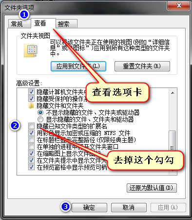
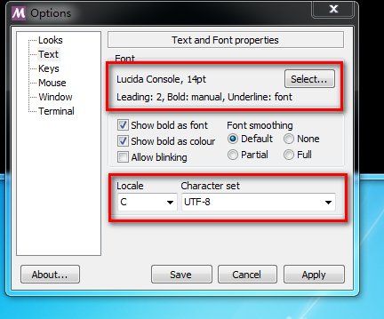

# Day01-HTML01

<!-- toc -->

## 01-计算机基础知识

### 01-1 文件和文件夹管理

* 掌握文件和文件夹的管理，包括创建、删除、重命名、复制、粘贴、剪切、移动。

* 掌握"文件扩展名"的意义

* 在Windows下,所有的文件的名字，是两部分组成的。语法

```
文件名.扩展名
```

> 扩展名一般就是2~4个字母,表示文件的格式。比如`.jpg`是图片格式，`.mp3`是音乐格式，`.doc`文档
> **一般来说，操作系统是不主动显示扩展名的，需要我们自己设置**

* Windows 7:




* Windows 10:


* OS X 10.9:


* 知道"打开方式"的意义

一个文件，可以用多种软打开，这就叫做打开方式


实际上现在你就应该树立一种思维，同一个文件可以用不同软件打开。

比如:**`.jpg`用照片查看器打开，就是浏览模式；用画图打开，就是编辑模式**

* 会使用桌面，知道"快捷方式"的概念

注意，桌面是一个特殊的文件夹。这个文件夹路径：`C:\Users\yh\Desktop`


快捷方式是什么？程序快速打开的一个入口，双击就能打开程序


所有快捷方式，都有一个小箭头图标。就是一个快捷入口，所以删除这个图标，程序还在

### 01-2 特殊按键和快捷键

键盘上除了有字母、数字之外，还有一些特殊的按键：Ctrl、Shift、Alt、Tab

* Ctrl键是英语control"控制"的意思，这个按键，单独按没有任何作用，都要和其他的按键一起按才有用。比如ctrl+c，表示同时按住ctrl键和c键，一会儿将知道这个功能是复制。
* Shift键是英语shift"换挡"的意思，按下这个按键同时击打字母，打出的就是大写字母。**熟悉shift键来打大写字母，尽量少用大小写锁定键。**
* Alt键是英语altemate"调整"的意思，和ctrl一样，自己按没啥用，都要和其他的按键一起按才有用。比如alt+f4，表示关闭当前的窗口，比如你正在玩儿游戏，老板来了，可以啊alt+f4快速关闭窗口。
* Tab键是用于tab"制表符"的意思，经常实现"切换的功能"。比如我们再word软件中同时打开了两个文档，可以用ctrl+tab键，来在两个文档之间切换。当然，可以用alt+tab键来切换程序。

必须掌握的快捷键：

* Ctrl+C 		复制
* Ctrl+V 		粘贴
* Ctrl+X	        剪切（就是移动文件，在原来的文件夹ctrl+x一个文件，然后在新文件夹中ctrl+v粘贴）
* Ctrl+Tab        切换（具体切换什么，要看是什么软件）
* Alt+F4            关闭程序
* F2                   重命名 
* F5                   刷新，比如看网页的时候，想刷新网页，按F5
* Ctrl+Z            撤销，就是这一步干错了，就ctrl+z撤销
* Windows+E 打开资源管理器 
* Windows+D 显示桌面
* Ctrl + 空格  切换中英文，严禁用shift键切换 


### 01-3 打字速度

打字速度是必备的素养！

* 严禁二指神功，必须养成正确的指法；比如打{时，要按住shift+[。正确的按键方法，是左手小拇指按住左边的shift键，右手中指按[键。
* 金山打字通，只需要练习英文打字，要求英文文章一定要练习到每分钟100字以上

## 02-互联网的原理

### 02-1 上网就是请求数据

网页上的内容，怎么就被我们看见了？什么是上网？

> 我们先不直接解决这个问题，我们做一个小实验。我们每个人的电脑里面，都有一个神秘的文件夹：`C:\Users\yh\AppData\Local\Microsoft\Windows\Temporary Internet Files`这个文件夹叫做临时文件夹（**文件夹知道存在就还好了，不用你自己查找**）

我们清空这个文件夹中的全部内容


我们打开IE浏览器，看几个网页。结果，这个文件夹中又多了很多的内容：


通过这个实验，目前为止，我们可以得出结论，上网的时候，是有真实的、物理的文件传输的！

所以我们经常感觉第二次打开网页，比第一次快，这是因为第一次打开网页的时候，所以得图片都已经存过来了。

所以我们也能够解释，为什么每次都用CCleaner能清理一堆垃圾，释放很多硬盘空间。

**我们发现，浏览了一个Google首页，就出现那么多的文件，所以现在我们的幼小的心灵中，就要有一个初步认识，网页不是一个文件，而是一堆文件。**

我们可以回答刚才的问题了，"上网"究竟是什么？答案：上网就是请求数据，就是文件传输

> 服务器上存放着网页的相关文件，包括html文件、css文件、js文件、图片等。当我们打开浏览器，输入网址，我们的计算机就会对这些文件发出HTTP请求。
> 服务器收到请求之后，会把这些文件通过HTTP协议，传输到我们的计算机中（保存到了刚才那个临时文件夹中）。这些文件，将在我们的计算机本地的浏览器中，进行渲染、呈递。

也就是说，本来人家文件好好的在服务器上睡大觉，你一输入网址，就把这些文件传输到本地计算机来了。这些文件在本地的计算机中，进行渲染，展示。

### 02-2 服务器

* 服务器就是计算机，只不过比我们用的笔记本的配置牛逼了很多，并且24小时不断电，不关机。
* 服务器上存储着网页的相关文件。一旦有访问者浏览网站，服务器就将发生这些文件给访问者。
* 服务器一旦关机，网站就无法访问了。
* 服务器的更多知识，我在讲到Ajax的知识后再补充。现在只需要了解基本概念就OK

### 02-3 浏览器

* 浏览器是按照再客户的电脑里面的，是一个软件，能够让用户上网。
* 浏览器有版本之分，有浏览器兼容问题。后面实际项目会讨论这个问题

### 02-4 HTTP

* 超文本传输协议，Hypertext Transfer Protocol.

>  这是一个文件的传输协议，我们上网的时候，所有的文件都是通过HTTP这个协议，从服务器上传输到客户的电脑里面的。

现在，我们只需要知道这些即可，Ajax上会详细讲解HTTP这个东西

> 后面我会给你讲如何购买www域名和空间，全年100元以内。

现在我们必须要树立一个思想，就是每一个网址，都对应着确定的服务器上的文件。

比如网址:

```
http://www.yhyangjiabin.tech/1.html
```

就是服务器上面的1.html文件

```
http://www.yhyangjiabin.tech/
```

看似没有精确到一个文件，但是有一个规定，就是index.html是默认的首页文件

index就是英语"目录"的意思。

```
http://www.yhyangjiabin.tech/aaa/b.html
```

服务器上面有一个aaa文件夹，这个文件夹里面有一个b.html文件。

上面的都没听懂没事，记住下面内容就好

**网页是真实物理的文件。并且一个是很多的物理文件组成的：html文件、图片文件、js文件、css文件。这些文件要通过特殊软件才能上传到服务器上。然后就能让用户看了。用户通过浏览器，访问网址，服务器上面的文件就会通过http请求悄悄地传输用户的电脑中的临时文件夹中，在用户的电脑中执行、渲染、呈递。**

## 03-开发环境配置

### 03-1 Windows 7 配置

* Windows电脑适用：针对硬件比较低的电脑,我们关闭一些Windows的功能和动画效果

打开控制面板，选择系统与安全。接下来如下图所示：


* Windows7需要安装.NET Framework 4.x版本以上，Windows 10需要安装.NET Framwork 3.5

### 03-2 Lantern和Proxifier 配置

> 配置这两个工具，是方便我们查阅资料（Google、GitHub、StackOverflow、Wikipedia），push代码到GitHub远程仓库

* Lantern安装和配置

Lantern下载地址：https://getlantern.org/en_US/

勾选代理所有流量，并记下代理地址和端口号


* Proxifier安装和配置

Proxifier下载地址：https://www.proxifier.com/

key:KFZUS-F3JGV-T95Y7-BXGAS-5NHHP

增加代理地址：


新建代理规则：


修改DNS hostname：


### 03-3 Git和GitHub 配置

> 安装Git是作为我们版本控制工具（简单理解为存储我们修改过的内容，存储多个版本后。需要用一个管理工具，所以我们选择Git），我们在本地操作GitBook，需要用到Git Bash这个组件。GitHub这个是远程仓库的一个著名网站。

* Git的安装配置

Git的下载地址：https://git-scm.com/

和一般应用安装类似，修改路径，一直下一步就OK。

Git Bash配置：

修改字体和字号大小：

修改编码格式：




修改主题样式，修改路径`/c/Users/yh`下 的`.minttyrc`文件

```
BoldAsFont=-1
Locale=C
Charset=UTF-8
FontHeight=14
BackgroundColour=13,25,38
ForegroundColour=217,230,242
CursorColour=217,230,242
Black=0,0,0
BoldBlack=38,38,38
Red=184,122,122
BoldRed=219,189,189
Green=122,184,122
BoldGreen=189,219,189
Yellow=184,184,122
BoldYellow=219,219,189
Blue=122,122,184
BoldBlue=189,189,219
Magenta=184,122,184
BoldMagenta=219,189,219
Cyan=122,184,184
BoldCyan=189,219,219
White=217,217,217
BoldWhite=255,255,255
FontHeight=14
```

* GitHub网站，GitHub Desktop安装和配置

GitHub网站：注册一个账号，**注册完成后，记得点击激活邮件的按钮或链接**，设置第二个邮箱（作为**展示邮箱**和配置链接本地电脑的邮箱，可以选择国内邮箱。**注册邮箱不要选择国内邮箱**）

GitHub Desktop安装和配置：

GitHub Desktop下载地址：https://desktop.github.com/

登陆GitHub账号：


配置GIt的用户名和邮箱（这里的邮箱填我们在GitHub上的**展示邮箱**）


**测试本地电脑和GitHub网站正常通信，我们需要**Lantern和Proxifier**配合**

新建一个本地仓库，增加README文件。并push到GitHub的远程仓库

### 03-4 GitBook和Markdown 配置

* GitBook（现阶段，主要记录我们学习笔记）的安装和配置

下载Node.js（先不解释，这是我们后面要学习的一个东西。我们现在这里用一下）：https://nodejs.org/en/

**选择LTS版本,长期支持版本**

验证是否按照成功

```bash
node -v

# 输出
v8.9.3

npm -v

# 输出
5.5.1
```


GitBook CLI安装

```bash
npm install -g gitbook-cli
```

GitBook安装和初始化GitBook书籍仓库

```bash
gitbook init Become_An_Programmmer_Note
```


增加`book.json`,配置笔记主要信息

```json
touch book.json // 创建书籍配置文件


// book.json
{
    "title": "如何成为一个开发者指导",
    "description": "学习如何为一个开发者,用最简单的前端知识作为基础",
    "language": "zh" ,
    "pdf": {
        "toc": true,
        "pageNumbers": false,
        "fontSize": 14,
        "paperSize": "a4",
        "margin": {
            "right": 62,
            "left": 62,
            "top": 36,
            "bottom": 36
        }
    },
    "plugins": [
        "prism",
        "-highlight"
    ] 
}
```

完成上面书籍配置文件，安装代码高亮插件。在书籍根目录执行下面命令：

```bash
gitbook install
```


增加书面封皮：

根目录下存两张图片（尺寸）：cover.jpg（1800x2360）、cover_small.jpg（200x262）

初始化一个Git仓库，增加忽略文件，并push到GitHub上

```bash
git init // 在书籍的根目录下执行

touch .gitignore

// .gitignore
# Node rules:
## Grunt intermediate storage (http://gruntjs.com/creating-plugins#storing-task-files)
.grunt

## Dependency directory
## Commenting this out is preferred by some people, see
## https://docs.npmjs.com/misc/faq#should-i-check-my-node_modules-folder-into-git
node_modules

# Book build output
_book

# eBook build output
output


# push GitHub
```

* 预览书籍

```bash
gitbook serve // 预览书籍

# 输出内容
Starting server ...
Serving book on http://localhost:4000
```

允许防火墙通过


成功预览


push到GitHub的远程仓库中


* 输出电子书籍格式ePub, Mobi, PDF

**Windows下的方法：安装Calibre应用，然后输入在书籍跟目录下输入下面命令**

**Windows下必须在Git Bash中输入,才能正确输出,如果报错。安装完Calibre，运行一次，再执行下面命令**

Calibre 下载地址：https://calibre-ebook.com/download

```bash
# Generate a PDF file
$ gitbook pdf ./ ./output/Become_An_Programmer_Note.pdf

# Generate an ePub file
$ gitbook epub ./ ./output/Become_An_Programmer_Note.epub

# Generate a Mobi file
$ gitbook mobi ./ ./output/Become_An_Programmer_Note.mobi
```

* 常用Markdown语言，后面有需要在增加语法

标题

```markdown
# This is an <h1> tag
## This is an <h2> tag
###### This is an <h6> tag
```

项目符号

```markdown
* Item 1
* Item 2
  * Item 2a
  * Item 2b
```

代码和代码块

```markdown
```
function test() {
  console.log("notice the blank line before this function?");
}
```
```

加粗

```markdown
**This text will be bold**
```

引用

```markdown
> the present is our past.
```

图片

```markdown

```

表格

```markdown
| First Header  | Second Header |
| ------------- | ------------- |
| Content Cell  | Content Cell  |
| Content Cell  | Content Cell  |
```

### 03-5 Visual Studio Code和Chrome、Firefox配置

* Visual Studio Code（作为代码编辑器和笔记记录工具）安装和配置

Visual Studio Code 下载地址：https://code.visualstudio.com/


* Visual Studio Code Tips:
    * 多行编辑快捷键:Shift + Alt + 鼠标左键选取要编辑的内容
    * 设置工作区,分别放置两个文件夹存储Note和Code
    * 设置文字显示大小为14
    * 安装插件
        * Cobalt2 Theme Official 主题
        * Path Intellisense 路径提示
        * vscode-icons 图标

* Chrome安装和配置

Chrome下载地址：https://enterprise.google.com/chrome/chrome-browser/

* Firefox安装和配置

Firfox下载地址：https://www.mozilla.org/en-US/firefox/all/

## 04-HTML初步认识

### 04-1 认识什么是纯文本文件txt

Windows中自带一个软件，叫做记事本。记事本保存的文档格式就是txt格式，就是英语text的缩写。术语上，称呼这个文件叫做"纯文本文件"。

我们做个实验，**发现doc这个文件能够保存内容和样式，字有红的、蓝的。但是txt格式有点不同**

我看到的：

>我只是改变了软件的设置，而没有改变txt这个文件的设置。txt文件压根就不能设置样式

你看到的：


**txt文件，只能保存文本内容，是无法记录文本样式的。**

所以，docx和txt存储同样的内容，docx比txt大：

> 纯文本文件就是这样的文件
> * 只有文本，没有样式
> * 用记事本等纯文本编辑器可读，不是乱码

结论：html、css、js都是纯文本的。

### 04-2 HTML是复杂描述文档语义的语言

**HTML是英语HyperText Markup Language的缩写，超文本标记语言。**

**HTML就是网页的格式**

现在，来制作我们人生中第一个网页

新建一个txt文件：

也就是说，html本质上和txt没有任何区别，他们都是纯文本文件。

我们强行把这个文件的扩展名，从txt更改为html，我们会发现小图标就变成浏览器的小图标了：


在"打开方式"中，用记事本可以编辑它。

现在要养成**编辑器里面编辑->保存Ctrl + S->浏览器里面刷新F5**的习惯

html到底干嘛用的，看一下例子：


## 05-HTML骨架和基本语法