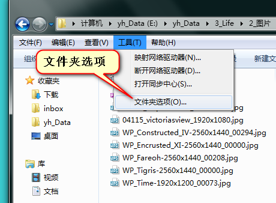
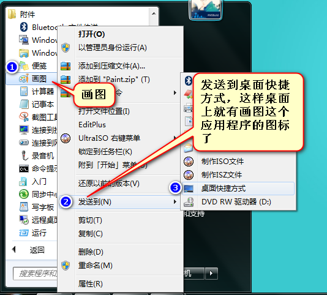
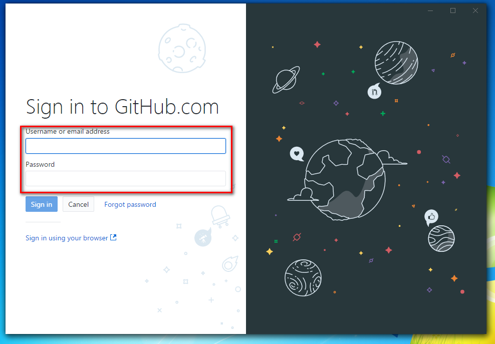

# Day01-HTML01

## 01-计算机基础知识

* 文件和文件夹管理

掌握文件和文件夹的管理,包括创建、删除、重命名、复制、粘贴、剪切、移动

* "文件扩展名"的意义

在Windows下，所有的文件的名字，是两部分组成的。语法:

`文件名.扩展名`

扩展名一般就是2~4个字母,表示文件的格式.比如`.jpg`是图片格式,`.mp3`
音乐格式,`.doc`文档.

**一般来说,操作系统,是不能显示扩展名的,需要我们自己设置**

* Windows7:




* Windows10:



* MacOS X 10.9:


* 知道"打开方式"的一样

一个文件,可以用多种软件打开,这就叫做打开方式。


## 02-Lantern和Proxifier安装和配置

* Lantern 安装

下载地址:https://getlantern.org/en_US/

* Lantern 配置


* Proxifier 安装

下载地址:https://www.proxifier.com/

* Proxifier配置

key:KFZUS-F3JGV-T95Y7-BXGAS-5NHHP


## Git和GitHub配置

* Git安装

下载地址:https://git-scm.com/


* Git Bash的配置


* GitHub Desktop 安装

下载地址:https://desktop.github.com/

* GitHub Desktop 配置

填入GitHub的用户名和密码


## Visual Studio Code安装和配置

* 使用Visual Studio Code 作为代码编辑器和笔记记录工具

* Visual Studio Code Tips:
    * 多行编辑快捷键:Shift + Alt + 鼠标左键选取要编辑的内容
    * 设置工作区,分别放置两个文件夹存储Note和Code
    * 设置文字显示大小为14
    * 安装插件
        * Cobalt2 Theme Official 主题
        * Path Intellisense 路径提示
        * vscode-icons 图标


## GitBook安装和配置

* Node.js 下载和安装

下载地址:https://nodejs.org/en/

选择LTS版本,长期支持版本

验证是否按照成功

```bash
node -v

# 输出
v8.9.3

npm -v

# 输出
5.5.1
```

* GitBook CLI 安装

```bash
npm install gitbook-cli -g
```



* 安装GitBook

参考网站:https://toolchain.gitbook.com/

```bash
# 安装GitBook并初始化书籍框架
gitbook init Developer_Guide_Book
```


* GitBook 初始化的书籍配置,创建book.json 文件

> 在书籍的路径下创建书籍的配置文件

```bash
touch book.json // 创建书籍配置文件


// book.json
{
    "title": "如何成为一个开发者指导",
    "description": "学习如何为一个开发者,用最简单的前端知识作为基础",
    "language": "zh" ,
    "pdf": {
        "toc": true,
        "pageNumbers": false,
        "fontSize": 14,
        "paperSize": "a4",
        "margin": {
            "right": 62,
            "left": 62,
            "top": 36,
            "bottom": 36
        }
    },
    "plugins": [
        "prism",
        "-highlight"
    ] 
}

gitbook install // 安装配置文件的插件
```

插件安装成功


* 初始化Git仓库,并创建Git关于Gitbook的忽略文件

```bash
git init // 在书籍的目录下执行

touch .gitignore

// .gitignore
# Node rules:
## Grunt intermediate storage (http://gruntjs.com/creating-plugins#storing-task-files)
.grunt

## Dependency directory
## Commenting this out is preferred by some people, see
## https://docs.npmjs.com/misc/faq#should-i-check-my-node_modules-folder-into-git
node_modules

# Book build output
_book

# eBook build output
output
```

* 预览书籍

```bash
gitbook serve // 预览书籍

# 输出内容
Starting server ...
Serving book on http://localhost:4000
```

允许防火墙访问


在浏览器中访问,`http://localhost:4000`


* 发布到GitHub中自己的账号

* 增加本地仓库


* 添加发布信息

* 完成发布


* 输出书籍到output文件夹

* 下载calibre:https://calibre-ebook.com/download

* Windows下直接安装就行

```bash
# Generate a PDF file
$ gitbook pdf ./ ./output/Developer_Guide_Book.pdf

# Generate an ePub file
$ gitbook epub ./ ./output/Developer_Guide_Book.epub

# Generate a Mobi file
$ gitbook mobi ./ ./output/Developer_Guide_Book.mobi
```

* 输出文件发布到百度云上