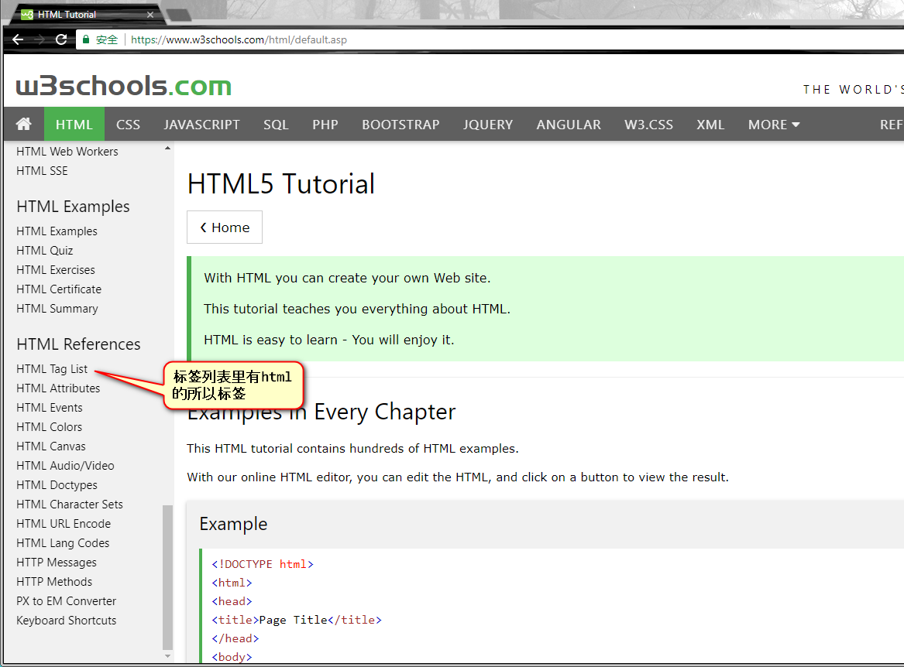

# Day02-HTML02

<!-- toc -->

## 01-HTML骨架

W3Schools 英文网站：https://www.w3schools.com/



标准骨架：

```html
<!DOCTYPE html PUBLIC "-//W3C//DTD XHTML 1.0 Transitional//EN" "http://www.w3.org/TR/xhtml1/DTD/xhtml1-transitional.dtd">
<html xmlns="http://www.w3.org/1999/xhtml" xml:lang="en">
<head>
    <meta http-equiv="Content-Type" content="text/html;charset=UTF-8" />
    <title>Document</title>
</head>
<body>
    
</body>
</html>
```

我们一部分一部分的学习下去

### 01-1 文档声明头
### 01-2 字符集
### 01-3 关键字和页面描述
### 01-4 title标签

## 02-HTML的基本语法特性

### 02-1 HTML对换行不敏感，对Tab不敏感
### 02-2 空白折叠现象
### 02-3 标签要严格封闭

## 03-h和p标签

### 03-1 h标签
### 03-2 p标签

## 04-图片

### 04-1 能用的图片类型
### 04-2 语法
### 04-3 alt属性
### 04-4 相对路径

## 05-超级链接

### 05-1 基本写法
### 05-2 a标签的另外两个属性
### 05-3 页面内的锚点
### 05-4 a是一个文本级的标签